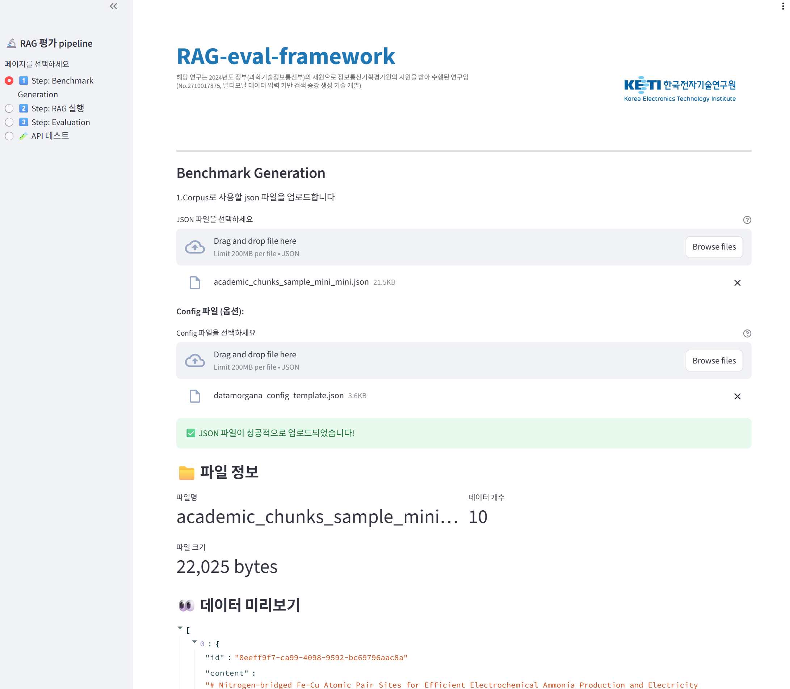
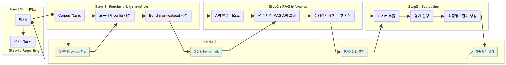

# RAG 평가 프레임워크 - Streamlit 웹 인터페이스

이 프로젝트는 End-to-End RAG 평가 프레임워크로, 테스트 데이터셋 생성부터 평가·리포팅까지 RAG 평가 전 과정을 지원합니다. RAG 응답을 받기 위해 참가자는 API를 제공해야 합니다.

## 🚀 빠른 시작

### 1. 의존성 설치

프로젝트 루트의 `requirements.txt`는 Streamlit 앱·Baseline API·RAGChecker 등 **메인 워크플로**용입니다 (Python 3.11 권장).

```bash
conda create -n rag-eval-framework python=3.11
conda activate rag-eval-framework
pip install -r requirements.txt
conda deactivate
```

멀티모달 Step 1 (PDF → OCR → QA)은 Streamlit이 **별도 conda 환경**에서 스크립트를 실행합니다. 아래 두 환경을 미리 만들어 두세요.

```bash
# OCR (DeepSeek-OCR 등, Python 3.12)
conda create -n deepseek-ocr python=3.12
conda activate deepseek-ocr
# CUDA·빌드 환경에 맞게 torch 설치
pip install torch==2.6.0 torchvision==0.21.0 torchaudio==2.6.0 --index-url https://download.pytorch.org/whl/cu118
# flash-attn은 CUDA·빌드 환경에 맞게 torch 설치 후 별도 실행:
pip install flash-attn==2.7.3 --no-build-isolation
# 필요 패키지 설치
pip install -r mmodal_generation/ocr_requirements.txt
conda deactivate

# 멀티모달 QA 생성 (Qwen3-VL 등, Python 3.12)
conda create -n Qwen3-VL python=3.12
conda activate Qwen3-VL
# CUDA·빌드 환경에 맞게 torch 설치
pip install torch==2.6.0 torchvision==0.21.0 torchaudio==2.6.0 --index-url https://download.pytorch.org/whl/cu118
# 필요 패키지 설치
pip install -r mmodal_generation/mmodal_gen_requirements.txt
conda deactivate
```

> Streamlit의 `run_in_conda_env`는 위 **환경 이름**(`deepseek-ocr`, `Qwen3-VL`)과 일치해야 합니다. 이름을 바꾼 경우 `streamlit/utils.py`의 호출부를 함께 수정하세요.

### 2. Academic RAG API 서버 시작
### 예시 academic rag 구성. 지식베이스 변경하려면 수정 해야함.
```bash
conda activate rag-eval-framework
python academic_rag_api.py
```

기본적으로 `http://localhost:5000`에서 동작합니다. WSL·Docker 등에서는 `0.0.0.0` 바인딩이 필요할 수 있습니다.

### 3. Streamlit 앱 시작

```bash
conda activate rag-eval-framework
streamlit run streamlit/Home.py
```

브라우저에서 `http://localhost:8501`로 접속합니다. (포트는 필요 시 `STREAMLIT_PORT` 등으로 변경 가능)

## 📋 사용법




### Step 1-1: Benchmark Generation (텍스트)

1. JSON 형식의 corpus 파일을 업로드합니다.
2. DataMorgana를 사용하여 QA 데이터를 생성합니다.
3. 생성된 QA 데이터를 미리보기하고 다운로드할 수 있습니다.

### Step 1-2: Multimodal (이미지·텍스트) Benchmark Generation

1. PDF가 들어 있는 ZIP 파일을 업로드합니다.
2. **`deepseek-ocr` conda 환경**에서 OCR을 수행합니다 (`test_ocr_processor.py`). 결과는 `mmodal_generation/ocr_output/<ZIP이름>/` 등에 저장됩니다.
3. **`Qwen3-VL` conda 환경**에서 QA를 생성합니다 (`test_qa_generator.py`). 기본 출력은 `streamlit/generated_qa_data_<ZIP이름>.json`입니다.
4. DataMorgana용 `datamorgana_config_template.json` 형식의 설정 파일을 업로드할 수 있습니다.

### Step 2: RAG 실행 (배치 API 호출)

1. 참가자의 RAG API URL을 입력합니다 (기본값: `http://localhost:5000`).
2. API 연결을 테스트합니다.
3. 처리할 질문 개수와 검색할 문서 개수(`top_k`)를 설정합니다.
4. QA 데이터를 사용하여 배치 방식으로 RAG API를 호출합니다.
5. 결과를 `results_for_eval.json`(또는 UI에서 지정한 경로)에 저장합니다.

### Step 3: Evaluation

1. RAG 실행 결과를 평가합니다.
2. RAGChecker를 사용하여 성능 메트릭을 계산합니다.
3. 평가 결과를 다운로드할 수 있습니다.

### API 테스트

1. 참가자의 API를 직접 테스트할 수 있습니다.
2. 단일 질의 및 배치 질의 테스트가 가능합니다.
3. API 상태 및 설정 정보를 확인할 수 있습니다.

## 🔧 API 스펙

### 배치 질의응답 API (권장)

**엔드포인트:** `POST /api/rag/batch`

**요청:**

```json
{
    "queries": ["질문1", "질문2", "질문3"],
    "top_k": 3
}
```

**응답:**

```json
{
    "results": [
        {
            "query": "질문1",
            "answer": "답변1",
            "retrieved_documents": [
                {
                    "doc_id": "document_id",
                    "text": "문서 내용",
                    "title": "문서 제목",
                    "distance": 0.85
                }
            ],
            "metadata": {
                "processing_time": 1.23,
                "num_retrieved": 3,
                "model": "gpt-3.5-turbo"
            }
        }
    ],
    "summary": {
        "total_queries": 3,
        "total_processing_time": 5.67,
        "average_processing_time": 1.89
    }
}
```

### 단일 질의응답 API

**엔드포인트:** `POST /api/rag/query`

**요청:**

```json
{
    "query": "질문 내용",
    "top_k": 3
}
```

**응답:**

```json
{
    "query": "질문",
    "answer": "답변",
    "retrieved_documents": [...],
    "metadata": {...}
}
```

## 🛠️ Baseline RAG 시스템 (로컬 테스트)

### Baseline RAG API 서버 사용

- Milvus 벡터 데이터베이스(Milvus Lite 등) 사용
- OpenAI `gpt-3.5-turbo` 및 `text-embedding-3-small` 사용
- 학술 논문 청크 기반 RAG
- 배치 처리 지원

### 테스트 방법

1. Academic RAG API 서버를 시작합니다.
2. Streamlit 앱에서 **API 테스트** 페이지로 이동합니다.
3. 연결 테스트를 수행합니다.
4. 단일 질의 및 배치 질의를 테스트합니다.

## 📁 파일 구조

```
RAG-eval-framework/
├── streamlit/                          # Streamlit 웹 인터페이스
│   ├── Home.py                       # 메인(홈) 페이지, 멀티페이지 진입점
│   ├── utils.py                      # 공통 UI·conda 실행 헬퍼
│   ├── pages/
│   │   ├── 1_Step_1_Benchmark_Generation.py              # 텍스트 벤치마크 생성
│   │   ├── 1_Step_1_Benchmark_Generation_multi_modal.py    # 멀티모달 벤치마크 생성
│   │   ├── 2_Step_2_RAG_Inference.py                      # RAG 배치 호출
│   │   ├── 3_Step_3_Evaluation.py                         # RAGChecker 평가
│   │   └── 4_API_Test.py                                  # API 테스트
│   └── README.md                     # Streamlit 쪽 보조 문서(경로 일부 구버전 참고 가능)
├── datamorgana/                      # 텍스트 QA 데이터 생성 모듈
│   ├── datamorgana_generator.py
│   ├── data/
│   └── ...
├── RAGChecker/                # RAG 평가 모듈
│   ├── quick_start.py         # 평가 실행 스크립트
│   ├── results/               # 평가 결과 저장
│   ├── ragchecker/            # 평가 라이브러리
│   └── ...
├── mmodal_generation/                # 멀티모달(OCR·비전 QA) 파이프라인
│   ├── ocr_processor.py
│   ├── qa_generator.py             # base Qwen3-VL 사용 멀티모달 QA 생성 스크립트    
│   ├── lora_tuned_qa_generator.py  # LoRA tuned Qwen3-VL 사용 멀티모달 QA 생성 스크립트
│   ├── test_ocr_processor.py       # Streamlit OCR 단계에서 호출
│   ├── test_qa_generator.py        # Streamlit QA 단계에서 호출
│   ├── pipeline.py
│   ├── ocr_requirements.txt
│   ├── mmodal_gen_requirements.txt
│   ├── data/
│   └── ...
├── docker_dir/                       # Docker 빌드·실행 문서 및 스크립트
│   └── DOCKER_README.md
├── assets/                           # README·앱용 이미지
├── academic_rag_api.py               # Baseline RAG API 서버
├── academic_rag.py                   # RAG 코어 로직
├── requirements.txt                  # 메인 Python 의존성
├── env.example                       # 환경 변수 예시
├── results_for_eval.json             # (예시) RAG 실행 결과
└── README.md
```

🚨 mmodal_generation/models 의 모델들은 Qwen3-VL-train 디렉토리에서 LoRA-SFT하여 export하였음. 


## ⚙️ 환경 변수

루트에 `.env`를 두고 사용합니다. 예시는 `env.example`을 참고하세요.

| 변수 | 설명 |
|------|------|
| `OPENAI_API_KEY` | OpenAI API 키 (Baseline RAG·일부 생성 단계에 필요) |
| `FLASK_ENV` | Flask 실행 모드 (예: `production`) |
| `FLASK_APP` | 기본 앱 모듈 (예: `academic_rag_api.py`) |
| `API_PORT` | RAG API 포트 (기본 `5000`) |
| `STREAMLIT_PORT` | Streamlit 포트 (기본 `8501`) |
| `MILVUS_PORT` | Milvus 서비스 포트 (기본 `19530`) |
| `PYTHONPATH` | Docker 등에서 앱 루트 경로 지정 시 사용 |

## 🚨 주의사항

1. **OpenAI API 키**: Baseline 파이프라인은 `OPENAI_API_KEY`가 필요합니다.
2. **메모리 사용량**: Milvus·임베딩·로컬 비전 모델 로딩 시 메모리 사용량이 클 수 있습니다.
3. **처리 시간**: 배치 RAG·OCR·QA 생성은 데이터량에 따라 시간이 오래 걸릴 수 있습니다.
4. **네트워크**: OpenAI·Hugging Face 모델 다운로드 등에 인터넷 연결이 필요할 수 있습니다.
5. **conda 환경 이름**: 멀티모달 UI는 `deepseek-ocr`, `Qwen3-VL` 이름의 환경을 기대합니다.
## 📄 라이선스

이 프로젝트는 Apache 2.0 라이선스 하에 배포됩니다.
