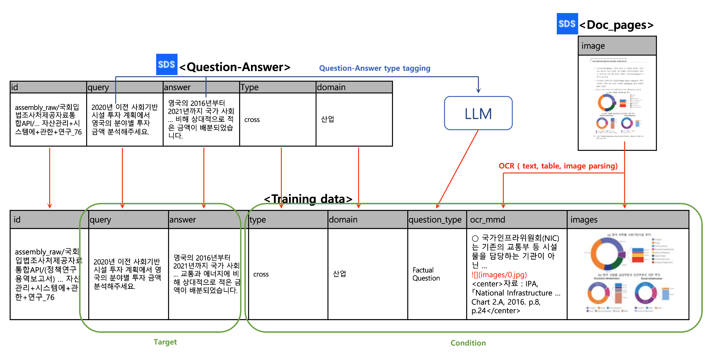
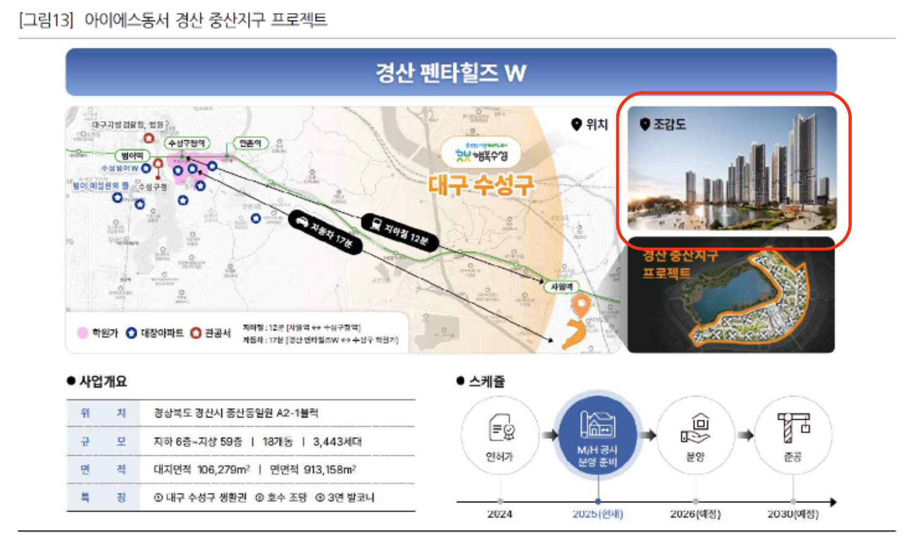

# RAG 평가 프레임워크 (RAG Eval Framework)

End-to-End RAG 평가 프레임워크입니다. 테스트 데이터셋(벤치마크) 생성부터 RAG 배치 실행, RAGChecker 기반 평가·리포팅까지 RAG 평가 전 과정을 Streamlit 웹 인터페이스로 지원합니다. 참가자는 정해진 API 스펙에 맞는 RAG API만 제공하면 자신의 RAG 시스템을 평가할 수 있습니다.


## 📌 전체 워크플로


| 단계 | 내용 | 실행 환경 |
|------|------|-----------|
| **Step 1-1** | 텍스트 corpus → DataMorgana 기반 QA 벤치마크 생성 | `rag-eval-framework` |
| **Step 1-2** | PDF(ZIP) → OCR → 멀티모달(이미지·텍스트) QA 벤치마크 생성 | `deepseek-ocr` → `Qwen3-VL` |
| **Step 2** | QA 데이터로 참가자 RAG API 배치 호출, 결과 저장 | `rag-eval-framework` |
| **Step 3** | RAGChecker로 성능 메트릭 계산·리포팅 | `rag-eval-framework` |

평가 대상 RAG가 없어도 테스트할 수 있도록 Baseline RAG API 서버(`academic_rag_api.py`)를 함께 제공합니다.

## 🚀 빠른 시작

### 1. 의존성 설치 (conda 환경 3개)

프로젝트 루트의 `requirements.txt`는 Streamlit 앱·Baseline API·RAGChecker 등 **메인 워크플로**용입니다 (Python 3.11 권장).

```bash
conda create -n rag-eval-framework python=3.11
conda activate rag-eval-framework
pip install -r requirements.txt
conda deactivate
```

멀티모달 Step 1-2 (PDF → OCR → QA)는 Streamlit이 **별도 conda 환경**에서 스크립트를 실행합니다. 멀티모달 벤치마크 생성을 사용하려면 아래 두 환경을 미리 만들어 두세요. (텍스트 워크플로만 쓴다면 생략 가능)

```bash
# OCR 환경 (DeepSeek-OCR 등, Python 3.12)
conda create -n deepseek-ocr python=3.12
conda activate deepseek-ocr
# torch는 CUDA·빌드 환경에 맞게 설치
pip install torch==2.6.0 torchvision==0.21.0 torchaudio==2.6.0 --index-url https://download.pytorch.org/whl/cu118
# flash-attn은 torch 설치 후 별도 실행
pip install flash-attn==2.7.3 --no-build-isolation
pip install -r mmodal_generation/ocr_requirements.txt
conda deactivate

# 멀티모달 QA 생성 환경 (Qwen3-VL 등, Python 3.12)
conda create -n Qwen3-VL python=3.12
conda activate Qwen3-VL
# torch는 CUDA·빌드 환경에 맞게 설치
pip install torch==2.6.0 torchvision==0.21.0 torchaudio==2.6.0 --index-url https://download.pytorch.org/whl/cu118
pip install -r mmodal_generation/mmodal_gen_requirements.txt
conda deactivate
```

> Streamlit의 `run_in_conda_env`는 위 **환경 이름**(`deepseek-ocr`, `Qwen3-VL`)과 일치해야 합니다. 이름을 바꾼 경우 `streamlit/utils.py`의 호출부를 함께 수정하세요.

### 2. 환경 변수 설정

루트에 `.env` 파일을 만들고 `OPENAI_API_KEY` 등을 설정합니다. 예시는 `env.example`을 참고하세요.

```bash
cp env.example .env
# .env 파일에서 OPENAI_API_KEY 등을 수정
```

### 3. Baseline RAG API 서버 시작 (선택)

평가 대상 RAG API가 따로 없다면 예시로 제공되는 Academic RAG API 서버를 사용할 수 있습니다. 지식베이스(청크 JSON)를 변경하려면 `chunks_file` 파라미터를 지정하거나 코드를 수정해야 합니다. 자세한 내용은 [academic_rag_api_README.md](academic_rag_api_README.md)를 참고하세요.

```bash
conda activate rag-eval-framework
python academic_rag_api.py
```

기본적으로 `http://localhost:5000`에서 동작합니다. WSL·Docker 등에서는 `0.0.0.0` 바인딩이 필요할 수 있습니다.

### 4. Streamlit 앱 시작

```bash
conda activate rag-eval-framework
streamlit run streamlit/Home.py
```

브라우저에서 `http://localhost:8501`로 접속합니다. (포트는 필요 시 `STREAMLIT_PORT` 등으로 변경 가능)

### Docker로 실행

conda 대신 Docker Compose로도 실행할 수 있습니다. 빌드·배포 상세는 [docker_dir/DOCKER_README.md](docker_dir/DOCKER_README.md)를 참고하세요.

```bash
cp env.example docker_dir/.env   # OPENAI_API_KEY 등 설정
cd docker_dir
docker compose up -d
```

| 구분 | URL |
|------|-----|
| API | http://localhost:20500 |
| Streamlit | http://localhost:20501 |

## 📋 사용법

### Step 1-1: Benchmark Generation (텍스트)

1. JSON 형식의 corpus 파일을 업로드합니다.
2. DataMorgana를 사용하여 QA 데이터를 생성합니다.
3. 생성된 QA 데이터를 미리보기하고 다운로드할 수 있습니다.

### Step 1-2: Multimodal (이미지·텍스트) Benchmark Generation

1. PDF가 들어 있는 ZIP 파일을 업로드합니다.
2. **`deepseek-ocr` conda 환경**에서 OCR을 수행합니다 (`test_ocr_processor.py`). 결과는 `mmodal_generation/ocr_output/<ZIP이름>/` 등에 저장됩니다.
3. **`Qwen3-VL` conda 환경**에서 QA를 생성합니다 (`test_qa_generator.py`). 기본 출력은 `streamlit/generated_qa_data_<ZIP이름>.json`입니다.
4. DataMorgana용 `datamorgana_config_template.json` 형식의 설정 파일을 업로드할 수 있습니다.

#### LoRA Finetuning: SDS-kopub VDR 데이터셋 기반 성능 향상

**SDS-kopub VDR 데이터셋**을 가공해, 조건(config)에 맞는 QA를 생성하도록 Qwen3-VL을 **LoRA-SFT**했습니다.



- QA 데이터에 LLM question type 태깅, 문서 페이지 이미지에 OCR을 적용해 **Target**(query, answer) + **Condition**(type, domain, question_type, ocr_mmd, images) 학습 데이터를 구성합니다.
- 학습된 모델은 `lora_tuned_qa_generator.py`에서 사용합니다 (base 대비 조건 반영·설명 품질 향상 — 아래 예시 참고).

#### 생성 예시: persona 기반 멀티모달 QA

설정 파일로 persona 분포를 지정하면 그에 따라 다양한 스타일의 QA가 생성됩니다. 아래는 투자 문서의 프로젝트 소개 페이지 이미지를 입력으로 사용한 예시입니다.

**입력 이미지**



**persona 설정 요약** (전체 형식은 `datamorgana_config_template.json` 참고)

| 분류 축 | 카테고리 (확률) |
|---------|----------------|
| expertise | expert 0.7 / novice 0.3 |
| factuality | factoid 0.6 / open-ended 0.4 |
| premise | direct 0.7 / with-premise 0.3 |
| phrasing | concise-and-natural 0.3 / verbose-and-natural 0.4 / short-search-query 0.15 / long-search-query 0.15 |
| linguistic_variation | similar-to-document 0.6 / distance-from-document 0.4 |
| language | korean 1.0 |
| domain-meta | investment 1.0 (투자 관련 문서) |
| qa_type | visual 0.4 / text 0.2 / cross 0.4 (이미지만·텍스트만·결합 기반 QA 비율) |

**생성 결과** — persona 조합이 **novice / open-ended / direct / verbose-and-natural / similar-to-document / korean / visual**로 샘플링된 경우:

Base (`qa_generator.py`):

```json
{
  "question": "경산 중산지구 프로젝트의 예정된 준공 연도는 언제인가?",
  "answer": "2030년 예정이다."
}
```

LoRA Finetuned (`lora_tuned_qa_generator.py`):

```json
{
  "question": "아이에스동서의 경산 중산지구 프로젝트는 어떤 위치에 있고, 주변의 주요 기반시설과 교통 환경은 어떤가요?",
  "answer": "아이에스동서의 경산 중산지구 프로젝트는 경상북도 경산시 중산동일원 A2-1블럭에 위치해 있습니다. 이 지역은 대구 수성구 생활권에 속하며, 주변으로 수성구청, 범어역, 수성구청역, 만촌역이 있으며, 자동차로 이동 시 수성구 학원가까지 약 17분 소요되고 지하철로는 사월역과 수성구청역까지 약 12분 소요됩니다. 주변에 학원가와 관공서가 있어 교통과 생활 인프라가 잘 갖춰져 있습니다. 또한, 경산 중산지구 프로젝트는 조감도에서 보듯이 대규모 복합 개발 단지로, 주변에 녹지와 인공호수가 조성되어 환경 친화적인 지역임을 알 수 있습니다."
}
```

### Step 2: RAG 실행 (배치 API 호출)

1. 참가자의 RAG API URL을 입력합니다 (기본값: `http://localhost:5000`).
2. API 연결을 테스트합니다.
3. 처리할 질문 개수와 검색할 문서 개수(`top_k`)를 설정합니다.
4. QA 데이터를 사용하여 배치 방식으로 RAG API를 호출합니다.
5. 결과를 `results_for_eval.json`(또는 UI에서 지정한 경로)에 저장합니다.

### Step 3: Evaluation

1. RAG 실행 결과를 평가합니다.
2. RAGChecker를 사용하여 성능 메트릭을 계산합니다 (`RAGChecker/quick_start.py`, 기본 추출기·체커: `openai/gpt-4o-mini`).
3. 평가 결과를 다운로드할 수 있습니다.

### API 테스트

1. 참가자의 API를 직접 테스트할 수 있습니다.
2. 단일 질의 및 배치 질의 테스트가 가능합니다.
3. API 상태 및 설정 정보를 확인할 수 있습니다.

## 🔧 API 스펙 (참가자 RAG API 계약)

참가자의 RAG 시스템은 아래 스펙을 만족하는 HTTP API로 제공되어야 합니다. 배치 API 계약(`queries`, `top_k`, `results[].answer`, `retrieved_documents`)만 맞추면 어떤 구현이든 평가할 수 있습니다. 전체 엔드포인트(`/health`, `/api/rag/config` 포함)와 curl 예시는 [academic_rag_api_README.md](academic_rag_api_README.md)를 참고하세요.

### 배치 질의응답 API (권장)

**엔드포인트:** `POST /api/rag/batch`

**요청:**

```json
{
    "queries": ["질문1", "질문2", "질문3"],
    "top_k": 3
}
```

**응답:**

```json
{
    "results": [
        {
            "query": "질문1",
            "answer": "답변1",
            "retrieved_documents": [
                {
                    "doc_id": "document_id",
                    "text": "문서 내용",
                    "title": "문서 제목",
                    "distance": 0.85
                }
            ],
            "metadata": {
                "processing_time": 1.23,
                "num_retrieved": 3,
                "model": "gpt-3.5-turbo"
            }
        }
    ],
    "summary": {
        "total_queries": 3,
        "total_processing_time": 5.67,
        "average_processing_time": 1.89
    }
}
```

### 단일 질의응답 API

**엔드포인트:** `POST /api/rag/query`

**요청:**

```json
{
    "query": "질문 내용",
    "top_k": 3
}
```

**응답:**

```json
{
    "query": "질문",
    "answer": "답변",
    "retrieved_documents": [...],
    "metadata": {...}
}
```

## 🛠️ Baseline RAG 시스템 (로컬 테스트)

`academic_rag_api.py`는 위 API 스펙을 구현한 Baseline RAG 서버입니다.

- Milvus 벡터 데이터베이스(Milvus Lite) 기반 하이브리드 검색 (dense + sparse)
- OpenAI `gpt-3.5-turbo`(답변 생성) 및 `text-embedding-3-small`(임베딩) 사용
- 학술 논문 청크 JSON을 지식베이스로 사용 (다른 청크 JSON으로 교체 가능)
- 배치 처리 지원

테스트 방법:

1. Academic RAG API 서버를 시작합니다.
2. Streamlit 앱에서 **API 테스트** 페이지로 이동합니다.
3. 연결 테스트를 수행합니다.
4. 단일 질의 및 배치 질의를 테스트합니다.

아키텍처·클래스 구조·엔드포인트 상세·트러블슈팅은 [academic_rag_api_README.md](academic_rag_api_README.md)에 정리되어 있습니다.

## 📁 파일 구조

```
rag-eval-framework/
├── streamlit/                          # Streamlit 웹 인터페이스
│   ├── Home.py                       # 메인(홈) 페이지, 멀티페이지 진입점
│   ├── utils.py                      # 공통 UI·conda 실행 헬퍼·RAGAPIClient
│   ├── pages/
│   │   ├── 1_Step_1_Benchmark_Generation.py              # 텍스트 벤치마크 생성
│   │   ├── 1_Step_1_Benchmark_Generation_multi_modal.py    # 멀티모달 벤치마크 생성
│   │   ├── 2_Step_2_RAG_Inference.py                      # RAG 배치 호출
│   │   ├── 3_Step_3_Evaluation.py                         # RAGChecker 평가
│   │   └── 4_API_Test.py                                  # API 테스트
│   └── README.md                     # Streamlit 쪽 보조 문서(경로 일부 구버전 참고 가능)
├── datamorgana/                      # 텍스트 QA 데이터 생성 모듈 (DataMorgana)
│   ├── datamorgana_generator.py
│   ├── prompts.py
│   └── README.md
├── RAGChecker/                       # RAG 평가 모듈
│   ├── quick_start.py                # 평가 실행 스크립트 (Step 3에서 호출)
│   ├── results/                      # 평가 결과 저장
│   ├── ragchecker/                   # 평가 라이브러리
│   └── ...
├── mmodal_generation/                # 멀티모달(OCR·비전 QA) 파이프라인
│   ├── ocr_processor.py
│   ├── qa_generator.py               # base Qwen3-VL 사용 멀티모달 QA 생성 스크립트
│   ├── lora_tuned_qa_generator.py    # LoRA tuned Qwen3-VL 사용 멀티모달 QA 생성 스크립트
│   ├── test_ocr_processor.py         # Streamlit OCR 단계에서 호출
│   ├── test_qa_generator.py          # Streamlit QA 단계에서 호출
│   ├── pipeline.py
│   ├── ocr_requirements.txt          # deepseek-ocr 환경용 의존성
│   ├── mmodal_gen_requirements.txt   # Qwen3-VL 환경용 의존성
│   └── ...
├── docker_dir/                       # Docker 빌드·실행 문서 및 스크립트
│   └── DOCKER_README.md
├── assets/                           # README·앱용 이미지
├── academic_rag_api.py               # Baseline RAG API 서버
├── academic_rag_api_README.md        # Baseline API 상세 문서
├── academic_rag.py                   # RAG 코어 로직
├── requirements.txt                  # 메인 Python 의존성 (rag-eval-framework 환경)
├── env.example                       # 환경 변수 예시
└── README.md                         # 이 문서
```

> `mmodal_generation/models`의 LoRA 모델들은 별도의 `Qwen3-VL-train` 디렉토리에서 SDS-kopub VDR 데이터셋으로 LoRA-SFT하여 export한 것입니다 (위 [LoRA Finetuning](#lora-finetuning-sds-kopub-vdr-데이터셋-기반-성능-향상) 참고).

## ⚙️ 환경 변수

루트에 `.env`를 두고 사용합니다. 예시는 `env.example`을 참고하세요.

| 변수 | 설명 |
|------|------|
| `OPENAI_API_KEY` | OpenAI API 키 (Baseline RAG·QA 생성·RAGChecker 평가에 필요) |
| `FLASK_ENV` | Flask 실행 모드 (예: `production`) |
| `FLASK_APP` | 기본 앱 모듈 (예: `academic_rag_api.py`) |
| `API_PORT` | RAG API 포트 (기본 `5000`) |
| `STREAMLIT_PORT` | Streamlit 포트 (기본 `8501`) |
| `MILVUS_PORT` | Milvus 서비스 포트 (기본 `19530`) |
| `PYTHONPATH` | Docker 등에서 앱 루트 경로 지정 시 사용 |

## 📚 상세 문서

| 문서 | 내용 |
|------|------|
| [academic_rag_api_README.md](academic_rag_api_README.md) | Baseline RAG API 아키텍처·엔드포인트·청크 스키마·트러블슈팅 |
| [docker_dir/DOCKER_README.md](docker_dir/DOCKER_README.md) | Docker 이미지 빌드·Compose 실행·배포 |
| [datamorgana/README.md](datamorgana/README.md) | DataMorgana QA 생성기 사용법 |
| [streamlit/README.md](streamlit/README.md) | Streamlit 쪽 보조 문서 (일부 경로는 구버전 기준) |

## 🚨 주의사항

1. **OpenAI API 키**: Baseline 파이프라인과 RAGChecker 평가에는 `OPENAI_API_KEY`가 필요합니다.
2. **메모리 사용량**: Milvus·임베딩·로컬 비전 모델(OCR·Qwen3-VL) 로딩 시 메모리 사용량이 클 수 있습니다.
3. **처리 시간**: 배치 RAG·OCR·QA 생성은 데이터량에 따라 시간이 오래 걸릴 수 있습니다. Baseline API는 첫 요청 시 전체 코퍼스 인덱싱으로 응답이 느릴 수 있습니다.
4. **네트워크**: OpenAI·Hugging Face 모델 다운로드 등에 인터넷 연결이 필요할 수 있습니다.
5. **conda 환경 이름**: 멀티모달 UI는 `deepseek-ocr`, `Qwen3-VL` 이름의 환경을 기대합니다.
6. **지식베이스 교체**: Baseline API는 싱글톤으로 인덱스를 캐시하므로, 다른 청크 JSON을 반영하려면 서버 재시작이 필요합니다.

## 📄 라이선스

이 프로젝트는 Apache 2.0 라이선스 하에 배포됩니다.
