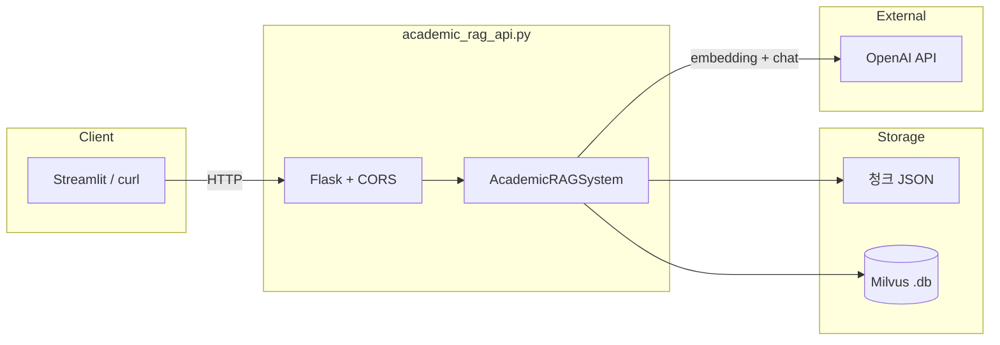

# Academic RAG API (`academic_rag_api.py`)

선택한 chunk JSON을 지식베이스로 삼아(default는 학술 논문 청크) **하이브리드 벡터 검색 + GPT 답변**을 제공하는 Flask REST API 서버 문서입니다.

- **단일 진입점**: `academic_rag_api.py` (다른 RAG 스크립트 import 없음)
- **평가 UI 연동**: Streamlit Step 2·API 테스트 페이지가 이 서버를 HTTP로 호출
- **자체 RAG 제출**: 동일한 `/api/rag/batch` 요청·응답 형식을 맞추면 교체 가능

---

## 아키텍처



**질의 한 건 처리 흐름**

1. 질문 → OpenAI `text-embedding-3-small` **dense 벡터**
2. 동일 질문 → 코드 내 간이 TF **sparse 벡터**
3. Milvus **하이브리드 검색**(dense + sparse, 가중 병합)으로 상위 `top_k` 청크
4. 청크를 `<context>`로 묶어 `gpt-3.5-turbo`(`temperature=0.3`) 답변 생성
5. 답변·검색 문서·메타데이터 JSON 반환

---

## 빠른 시작

### 사전 요구 사항

- Python 3.11 권장 (`requirements.txt`)
- **`OPENAI_API_KEY`** (필수)
- 청크 JSON 파일 (경로는 기동 후 요청으로 지정 가능)

```bash
conda activate rag-eval-framework
pip install -r requirements.txt

export OPENAI_API_KEY=your_key
python academic_rag_api.py
```

기본 주소: **`http://0.0.0.0:5000`** (로컬: `http://localhost:5000`)

WSL·Docker 등 원격 접속 시 `host='0.0.0.0'`으로 바인딩됩니다.

---

## `AcademicRAGSystem` 클래스

Flask 라우트는 전역 `get_rag_system()`으로 싱글톤 인스턴스를 받아 사용합니다.

| 메서드 | 설명 |
|--------|------|
| `initialize()` | OpenAI 클라이언트, Milvus 컬렉션 생성, 청크 인덱싱 |
| `emb_dense()` | `text-embedding-3-small` dense 임베딩 |
| `emb_sparse()` | 간이 TF sparse 벡터 (해시 인덱스) |
| `load_json()` | 청크 JSON 배열 로드 |
| `create_milvus_collection()` | `academic_chunks` 스키마·인덱스 생성 |
| `insert_chunks_to_milvus()` | 청크 분할·병렬 임베딩·Milvus 삽입 |
| `search_similar_chunks()` | dense + sparse 하이브리드 검색 |
| `generate_answer()` | 검색 청크 + GPT-3.5-turbo 답변 |
| `process_question()` | 단일 질의 (검색 + 생성 + 메타데이터) |
| `process_batch_questions()` | 여러 질의 순차 처리 |

### 초기화 (`initialize`)

1. OpenAI 클라이언트 생성
2. 테스트 문장으로 임베딩 차원 확인
3. `chunks_file` JSON 로드
4. Milvus 컬렉션 `academic_chunks` 생성  
   - 필드: `id`, `dense_vector`, `sparse_vector`, `content`, `title`, `original_id`
5. 각 청크 분할·임베딩 후 삽입  
   - DB: 청크 JSON과 **같은 디렉터리**의 `{파일명}.db`  
   - 예: `datamorgana/data/foo.json` → `datamorgana/data/foo.db`

**싱글톤**: 프로세스당 한 번만 인덱스를 구축합니다. 다른 코퍼스를 쓰려면 **서버 재시작**이 필요합니다.

**기본 `chunks_file`** (`chunks_file` 미지정 시, API **실행 디렉터리** 기준):

`uploaded_files/academic_chunks_sample_mini.json`

### 청크 JSON 스키마

배열 JSON. 각 요소 예시:

```json
{
  "id": "uuid-or-string",
  "title": "논문 또는 섹션 제목",
  "content": "본문 텍스트"
}
```

- `content`가 비어 있으면 해당 행은 건너뜁니다.
- 본문이 길면 `RecursiveCharacterTextSplitter`(chunk 2200, overlap 220)로 여러 벡터로 분할됩니다.
- 임베딩 삽입은 `ThreadPoolExecutor`(5 workers)로 병렬 처리합니다.

### 하이브리드 검색

`search_similar_chunks()` 기본값:

| 파라미터 | 기본값 |
|----------|--------|
| `dense_weight` | 0.7 |
| `sparse_weight` | 0.3 |
| `limit` | `top_k` (요청값, 기본 3) |

Sparse는 외부 BM25가 아니라 코드 내 TF(해시 인덱스)입니다.

### 답변 생성 프롬프트

검색 청크를 `[출처: 제목]\n본문`으로 이어 붙이고, `<context>` / `<question>` 태그로 GPT-3.5-turbo에 전달합니다.

---

## REST API

### `GET /health`

서버 및 RAG 초기화 상태. **최초 호출 시** 전체 인덱싱이 시작될 수 있어 응답이 느릴 수 있습니다.

**Query (선택)**

| 파라미터 | 설명 |
|----------|------|
| `chunks_file` | 청크 JSON 경로 |

**응답 예시**

```json
{
  "status": "healthy",
  "message": "Academic RAG API 서버가 정상적으로 실행 중입니다.",
  "version": "1.0.0",
  "initialized": true,
  "chunks_file": "/path/to/chunks.json"
}
```

### `GET /api/rag/config`

지원 엔드포인트, `top_k` 한도, 모델명 등 메타정보.

### `POST /api/rag/query`

단일 질의.

**Query (선택):** `chunks_file`

**Body**

```json
{
  "query": "인공지능이란 무엇인가요?",
  "top_k": 3
}
```

**응답 예시**

```json
{
  "query": "인공지능이란 무엇인가요?",
  "answer": "생성된 답변 텍스트",
  "retrieved_documents": [
    {
      "doc_id": 0,
      "text": "검색된 본문",
      "title": "출처 제목",
      "distance": 0.82
    }
  ],
  "metadata": {
    "processing_time": 2.15,
    "num_retrieved": 3,
    "model": "gpt-3.5-turbo",
    "timestamp": 1715788800.0
  }
}
```

### `POST /api/rag/batch`

여러 질문 순차 처리 (Streamlit Step 2·API 테스트에서 사용).

**Body**

```json
{
  "queries": ["질문1", "질문2"],
  "top_k": 3,
  "chunks_file": "datamorgana/data/academic_chunks_sample.json"
}
```

`chunks_file`은 body 또는 query string으로 전달 가능.

**응답 예시**

```json
{
  "results": [],
  "summary": {
    "total_queries": 2,
    "total_processing_time": 4.3,
    "average_processing_time": 2.15,
    "model": "gpt-3.5-turbo",
    "timestamp": 1715788800.0
  }
}
```

`results` 각 항목은 `process_question()` 반환 형식과 동일합니다. 개별 질문 실패 시에도 배치는 계속되며, 해당 항목에 `metadata.error`가 들어갈 수 있습니다.

### curl 예시

```bash
# 헬스 체크 (청크 파일 지정)
curl "http://localhost:5000/health?chunks_file=datamorgana/data/academic_chunks_sample.json"

# 단일 질의
curl -X POST http://localhost:5000/api/rag/query \
  -H "Content-Type: application/json" \
  -d '{"query": "What is machine learning?", "top_k": 3}'

# 배치 질의
curl -X POST http://localhost:5000/api/rag/batch \
  -H "Content-Type: application/json" \
  -d '{"queries": ["Q1", "Q2"], "top_k": 3}'
```

---

## Streamlit 평가 프레임워크 연동

1. API 서버: `python academic_rag_api.py`
2. Streamlit: `streamlit run streamlit/Home.py`
3. **Step 2: RAG Inference** 또는 **API 테스트**에서 `http://localhost:5000` 호출
4. 클라이언트: `streamlit/utils.py`의 `RAGAPIClient` (`/health`, `/api/rag/batch`, `/api/rag/config`)

자체 RAG를 붙일 때는 배치 API 계약(`queries`, `top_k`, `results[].answer`, `retrieved_documents`)만 맞추면 됩니다.

---

## 환경 변수

| 변수 | 설명 |
|------|------|
| `OPENAI_API_KEY` | 임베딩·채팅 API (필수) |
| `FLASK_APP` | Docker 등에서 `academic_rag_api.py` |
| `API_PORT` | compose 문서상 기본 5000 (코드는 포트 5000 고정) |

`env.example` 참고.

---

## 관련 파일

```
rag-eval-framework/
├── academic_rag_api.py          # Flask API 서버 (이 문서의 대상)
├── academic_rag_api_README.md   # 이 문서
├── datamorgana/data/             # 샘플 청크 (경로는 배포에 따라 상이)
└── streamlit/utils.py           # RAGAPIClient
```

---

## 트러블슈팅

| 증상 | 가능 원인 | 조치 |
|------|-----------|------|
| `/health` 500 | `OPENAI_API_KEY` 없음, 청크 파일 없음 | 키·경로 확인 |
| 첫 요청 매우 느림 | 전체 코퍼스 인덱싱 | 정상; 이후는 검색+생성만 |
| 임베딩 오류·청크 스킵 | 본문이 모델 컨텍스트 초과 | 분할기·`chunk_size` 조정 |
| 다른 코퍼스 반영 안 됨 | 싱글톤 캐시 | 서버 재시작 |
| WSL에서 Windows 접속 불가 | 바인딩 주소 | `0.0.0.0:5000` 사용 중 |

---

## 관련 문서

- 프로젝트 전체: [README.md](README.md)
- Streamlit 워크플로: [streamlit/README.md](streamlit/README.md)
